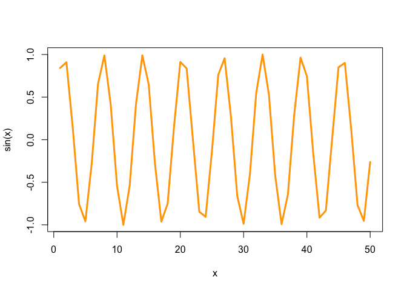

# Class 4 Lab
Li Ling (A15092789)

``` r
#this is my first R script
x <- 1:50 
plot(x)
```


``` r
plot(x,col="pink")
```


``` r
plot(x, sin(x),typ="l",col="orange", lwd="3")
```



``` r
log(10, base=10)
```

    [1] 1

``` r
log(10)
```

    [1] 2.302585
