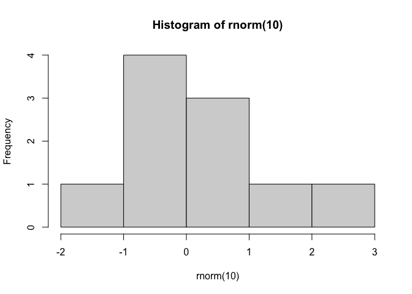
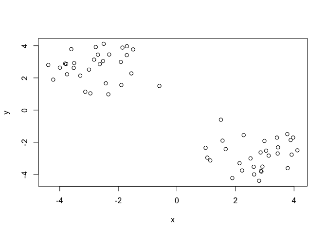
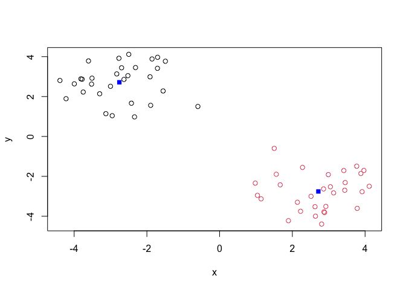
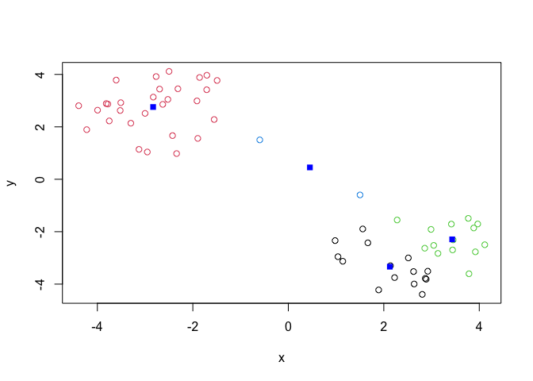
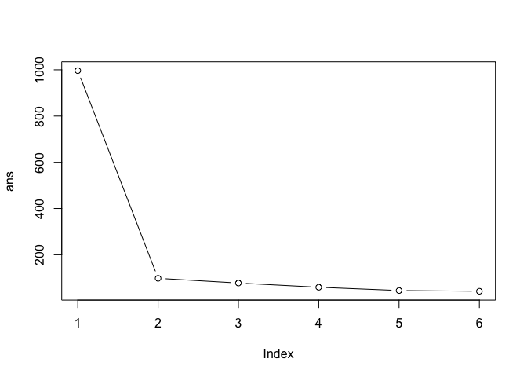
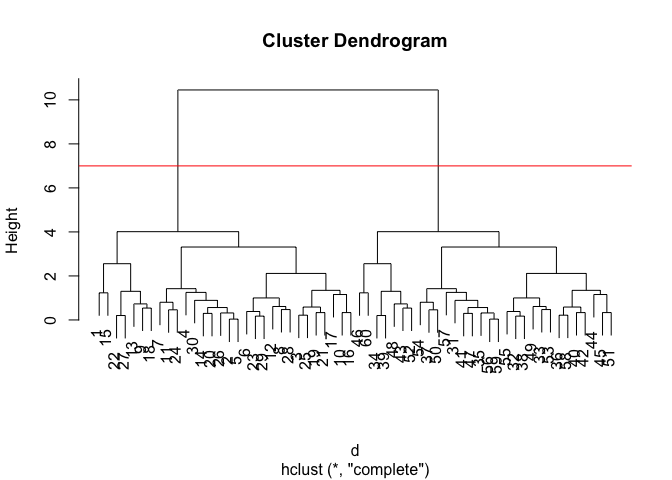
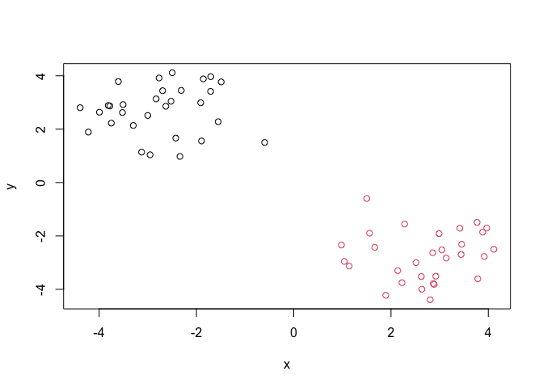
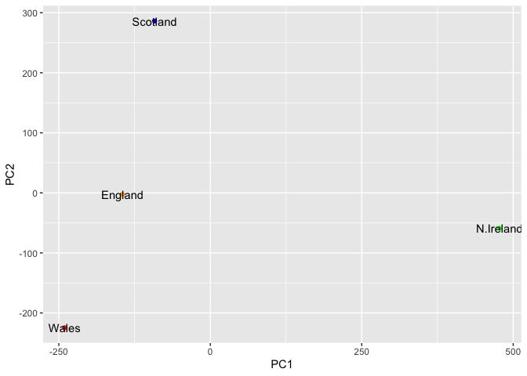

# Class 07: Machine Learning 1
Li Ling (A15092789)

Today we will begin our exploration of some “classical” machine learning
approaches. We will start with clustering:

Let’s first make up some data cluster where we know what the answer
should be.

``` r
hist(rnorm(10))
```



``` r
x <- c(rnorm(30, mean=-3), rnorm(30, mean=3))
y <- rev(x)
x <- cbind(x,y) #cbind: column binding, rbind: row binding
head (x)
```

                 x        y
    [1,] -1.553272 2.279735
    [2,] -3.779873 2.869847
    [3,] -2.522510 3.045959
    [4,] -4.222529 1.892470
    [5,] -3.813683 2.887507
    [6,] -1.491730 3.769799

A peak at x with `plot`

``` r
plot(x)
```



The main function in “base” R for K-means clustering is called
`kmeans()`,

``` r
k <- kmeans(x, centers=2)
k
```

    K-means clustering with 2 clusters of sizes 30, 30

    Cluster means:
              x         y
    1 -2.757221  2.715280
    2  2.715280 -2.757221

    Clustering vector:
     [1] 1 1 1 1 1 1 1 1 1 1 1 1 1 1 1 1 1 1 1 1 1 1 1 1 1 1 1 1 1 1 2 2 2 2 2 2 2 2
    [39] 2 2 2 2 2 2 2 2 2 2 2 2 2 2 2 2 2 2 2 2 2 2

    Within cluster sum of squares by cluster:
    [1] 49.04056 49.04056
     (between_SS / total_SS =  90.2 %)

    Available components:

    [1] "cluster"      "centers"      "totss"        "withinss"     "tot.withinss"
    [6] "betweenss"    "size"         "iter"         "ifault"      

> Q. How big are the clusters (i.e. their size)

``` r
k$size #you can access different parts of the kmeans object with the $ operator
```

    [1] 30 30

> Q. What data do my data points reside in?

``` r
k$cluster
```

     [1] 1 1 1 1 1 1 1 1 1 1 1 1 1 1 1 1 1 1 1 1 1 1 1 1 1 1 1 1 1 1 2 2 2 2 2 2 2 2
    [39] 2 2 2 2 2 2 2 2 2 2 2 2 2 2 2 2 2 2 2 2 2 2

> Q. Make a plot of our data by cluster assignment - i.e. make a result
> figure.

``` r
plot(x, col=k$cluster)
points(k$centers, col="blue",pch=15)
```



> Q. Cluster withk-means into 4 clusters and plot your results.

``` r
k4 <- kmeans(x, centers=4)

plot(x, col=k4$cluster)
points(k4$centers, col="blue",pch=15)
```



> Q. Run K-means with centers (i.e. value of k) equal 1 to 6.

``` r
k1 <- kmeans(x, centers= 1)$tot.withinss #total within cluster sum of squares
k2 <- kmeans(x, centers= 2)$tot.withinss
k3 <- kmeans(x, centers= 3)$tot.withinss
k4 <- kmeans(x, centers= 4)$tot.withinss
k5 <- kmeans(x, centers= 5)$tot.withinss
k6 <- kmeans(x, centers= 6)$tot.withinss

ans <- c(k1, k2, k3, k4, k5, k6)
```

Or use a for loop

``` r
ans <- NULL
for(i in 1:6){
  ans <- c(ans,kmeans(x,centers=i)$tot.withinss)
}
ans
```

    [1] 996.52935  98.08112  77.67564  59.50040  45.27955  42.15215

Make a “screen-plot”

``` r
plot(ans, typ="b")
```



## Hierarchical Clustering

The main funciton in “base” R for this is called `hclust()`

``` r
d <- dist(x)
hc <- hclust(d)
hc
```


    Call:
    hclust(d = d)

    Cluster method   : complete 
    Distance         : euclidean 
    Number of objects: 60 

``` r
plot(hc) #draw out the distance between data points, the closer they are, the smaller umbrella they will be under
abline(h=7, col="red") #draw a horizontal line at height 7
```



To obtain clusters from our `hclust` result object **hc**, we “cut” tree
to yield different sub branches. For this we use the `cutree()`
function.

``` r
grps <- cutree(hc, h=7) #cut at height 7
```

``` r
plot(x, col=grps)
```



notes: kmeans(x, centers) hclust(dist(x))

## Principle Component Analysis (PCA)

PCA is a dimensionality reduction technique. It finds the directions of
maximum variance in high-dimensional data and projects it onto a smaller
dimensional subspace while retaining most of the variance in the data.

Principal components are new low dimensional axis (or surfaces) that are
linear combinations of the original variables. The first principal
component captures the maximum variance in the data, the second
principal component captures the maximum remaining variance orthogonal
to the first, and so on.

``` r
url <- "https://tinyurl.com/UK-foods"
x <- read.csv(url)
```

> Q1. How many rows and columns are in your new data frame named x? What
> R functions could you use to answer this questions?

## Complete the following code to find out how many rows and columns are in x?

\_\_\_(x)

``` r
nrow(x) 
```

    [1] 17

``` r
ncol(x)
```

    [1] 5

``` r
dim(x)
```

    [1] 17  5

## Preview the first 6 rows

\_\_\_(x)

``` r
head(x)
```

                   X England Wales Scotland N.Ireland
    1         Cheese     105   103      103        66
    2  Carcass_meat      245   227      242       267
    3    Other_meat      685   803      750       586
    4           Fish     147   160      122        93
    5 Fats_and_oils      193   235      184       209
    6         Sugars     156   175      147       139

## Set the row names to be the first column

> Q2. Which approach to solving the ‘row-names problem’ mentioned above
> do you prefer and why? Is one approach more robust than another under
> certain circumstances?

Like the Second one becasue it will not minus index as we click more
than one time.

# Note how the minus indexing works

``` r
rownames(x) <- x[,1]
x <- x[,-1]
head(x)
```

                   England Wales Scotland N.Ireland
    Cheese             105   103      103        66
    Carcass_meat       245   227      242       267
    Other_meat         685   803      750       586
    Fish               147   160      122        93
    Fats_and_oils      193   235      184       209
    Sugars             156   175      147       139

``` r
x <- read.csv(url, row.names=1)
head(x)
```

                   England Wales Scotland N.Ireland
    Cheese             105   103      103        66
    Carcass_meat       245   227      242       267
    Other_meat         685   803      750       586
    Fish               147   160      122        93
    Fats_and_oils      193   235      184       209
    Sugars             156   175      147       139

## Spotting major differences and trend

``` r
# Using base R
barplot(as.matrix(x), beside=T, col=rainbow(nrow(x)))
```


> Q3: Changing what optional argument in the above barplot() function
> results in the following plot?

The optional argument is beside=F

``` r
# Using base R
barplot(as.matrix(x), beside=F, col=rainbow(nrow(x)))
```


> Q4: Changing what optional argument in the above ggplot() code results
> in a stacked barplot figure?

``` r
library(tidyr)

# Convert data to long format for ggplot with `pivot_longer()`
x_long <- x |> 
          tibble::rownames_to_column("Food") |> 
          pivot_longer(cols = -Food, 
                       names_to = "Country", 
                       values_to = "Consumption")
```

``` r
# Create grouped bar plot

library(ggplot2)
```

    Warning: package 'ggplot2' was built under R version 4.5.2

``` r
ggplot(x_long) +
  aes(x = Country, y = Consumption, fill = Food) +
  geom_col(position = "stack") +
  theme_bw()
```


\##Pairs plots and heatmap Scatterplot matrices can be useful for
relatively small datasets like this one. Let’s have a look:

> Q5: We can use the pairs() function to generate all pairwise plots for
> our countries. Can you make sense of the following code and resulting
> figure? What does it mean if a given point lies on the diagonal for a
> given plot?

Different dots are different foods and drinks, the line represent how
similar the consumptions are between two countries. If it lies on the
diagonal, it means that the consumption of that food/drink is similar
between the two countries. If it is far from the diagonal, it means that
the consumption is different between the two countries. Top right
figure: Above the line -\> England consume more, below the line -\>
Ireland consume more.

``` r
pairs(x, col=rainbow(nrow(x)), pch=16)
```


``` r
library(pheatmap)

pheatmap( as.matrix(x) )
```


> Q6. Based on the pairs and heatmap figures, which countries cluster
> together and what does this suggest about their food consumption
> patterns? Can you easily tell what the main differences between N.
> Ireland and the other countries of the UK in terms of this data-set?

It looks like Wales and Englandare quite similar in their consumption of
these foods. It is still quite difficult to tell what is going on in the
dataset.

## PCA to the rescue

The main function in “base” R for PCA is called `prcomp()`. As we want
to do PCA on the food data for the different countries we still want the
foods in the columns.

``` r
# Use the prcomp() PCA function 
pca <- prcomp(t(x))
summary(pca)
```

    Importance of components:
                                PC1      PC2      PC3       PC4
    Standard deviation     324.1502 212.7478 73.87622 2.921e-14
    Proportion of Variance   0.6744   0.2905  0.03503 0.000e+00
    Cumulative Proportion    0.6744   0.9650  1.00000 1.000e+00

Our result object called `pca` and it has a `$x` component that we will
look at first. It summerize all data, where the country lies in the
first two principal components.

``` r
pca$x
```

                     PC1         PC2        PC3           PC4
    England   -144.99315   -2.532999 105.768945 -9.152022e-15
    Wales     -240.52915 -224.646925 -56.475555  5.560040e-13
    Scotland   -91.86934  286.081786 -44.415495 -6.638419e-13
    N.Ireland  477.39164  -58.901862  -4.877895  1.329771e-13

``` r
library(ggplot2)

cols <- c("orange","red","blue","green")
ggplot(pca$x)+
  aes(PC1, PC2, label=rownames(pca$x))+
  geom_point(col=cols)+
  geom_text()
```



PC1 is more important as it covers more data compares to PC2.

Another major result outof PCA is the so-called “variable loadings” or
`$rotation`. That tells us how original variables (i.e. foods)
contribute to the PCs (i.e. our new axis).

``` r
ggplot(pca$rotation)+
  aes(PC1, rownames(pca$rotation))+
  geom_col()
```


