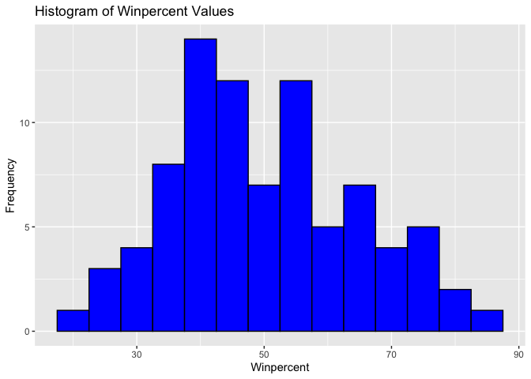
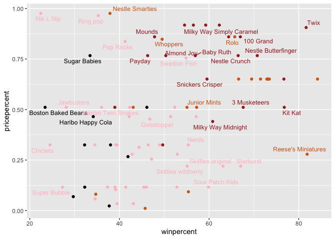
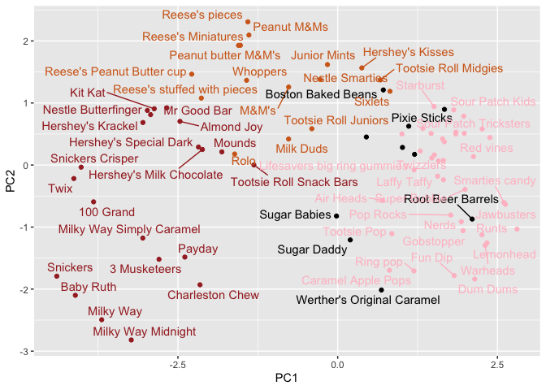
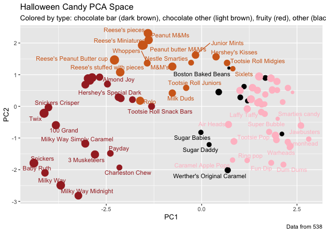

# Class 10: Halloween Project
Li Ling (A15092789)

## Importing Candy Data

``` r
candy_file <- "candy-data.csv"

candy = read.csv(candy_file, row.names=1)
head(candy)
```

                 chocolate fruity caramel peanutyalmondy nougat crispedricewafer
    100 Grand            1      0       1              0      0                1
    3 Musketeers         1      0       0              0      1                0
    One dime             0      0       0              0      0                0
    One quarter          0      0       0              0      0                0
    Air Heads            0      1       0              0      0                0
    Almond Joy           1      0       0              1      0                0
                 hard bar pluribus sugarpercent pricepercent winpercent
    100 Grand       0   1        0        0.732        0.860   66.97173
    3 Musketeers    0   1        0        0.604        0.511   67.60294
    One dime        0   0        0        0.011        0.116   32.26109
    One quarter     0   0        0        0.011        0.511   46.11650
    Air Heads       0   0        0        0.906        0.511   52.34146
    Almond Joy      0   1        0        0.465        0.767   50.34755

``` r
flextable::flextable(head(candy))
```


``` r
library(dplyr)
```


    Attaching package: 'dplyr'

    The following objects are masked from 'package:stats':

        filter, lag

    The following objects are masked from 'package:base':

        intersect, setdiff, setequal, union

> Q1. How many different candy types are in this dataset?

There are 85 different candy types in this dataset.

``` r
num_candy_types <- nrow(candy)
num_candy_types
```

    [1] 85

> Q2. How many fruity candy types are in the dataset? The functions
> dim(), nrow(), table() and sum() may be useful for answering the first
> 2 questions.

There are 38 fruity candy types in this dataset.

``` r
num_fruity_candies <- sum(candy$fruity)
num_fruity_candies
```

    [1] 38

``` r
candy["Twix", ]$winpercent
```

    [1] 81.64291

## What is your favorate candy?

> Q3. What is your favorite candy in the dataset and what is it’s
> winpercent value?

The winpercent value for “Snickers” is 76.67%.

``` r
candy["Snickers", ]$winpercent
```

    [1] 76.67378

> Q4. What is the winpercent value for “Kit Kat”?

The winpercent value for “Kit Kat” is 76.77%.

``` r
candy["Kit Kat", ]$winpercent
```

    [1] 76.7686

> Q5. What is the winpercent value for “Tootsie Roll Snack Bars”?

The winpercent value for “Tootsie Roll Snack Bars” is 49.65%.

``` r
candy["Tootsie Roll Snack Bars", ]$winpercent
```

    [1] 49.6535

``` r
library("skimr")
skim(candy)
```

|                                                  |       |
|:-------------------------------------------------|:------|
| Name                                             | candy |
| Number of rows                                   | 85    |
| Number of columns                                | 12    |
| \_\_\_\_\_\_\_\_\_\_\_\_\_\_\_\_\_\_\_\_\_\_\_   |       |
| Column type frequency:                           |       |
| numeric                                          | 12    |
| \_\_\_\_\_\_\_\_\_\_\_\_\_\_\_\_\_\_\_\_\_\_\_\_ |       |
| Group variables                                  | None  |

Data summary

**Variable type: numeric**

| skim_variable | n_missing | complete_rate | mean | sd | p0 | p25 | p50 | p75 | p100 | hist |
|:---|---:|---:|---:|---:|---:|---:|---:|---:|---:|:---|
| chocolate | 0 | 1 | 0.44 | 0.50 | 0.00 | 0.00 | 0.00 | 1.00 | 1.00 | ▇▁▁▁▆ |
| fruity | 0 | 1 | 0.45 | 0.50 | 0.00 | 0.00 | 0.00 | 1.00 | 1.00 | ▇▁▁▁▆ |
| caramel | 0 | 1 | 0.16 | 0.37 | 0.00 | 0.00 | 0.00 | 0.00 | 1.00 | ▇▁▁▁▂ |
| peanutyalmondy | 0 | 1 | 0.16 | 0.37 | 0.00 | 0.00 | 0.00 | 0.00 | 1.00 | ▇▁▁▁▂ |
| nougat | 0 | 1 | 0.08 | 0.28 | 0.00 | 0.00 | 0.00 | 0.00 | 1.00 | ▇▁▁▁▁ |
| crispedricewafer | 0 | 1 | 0.08 | 0.28 | 0.00 | 0.00 | 0.00 | 0.00 | 1.00 | ▇▁▁▁▁ |
| hard | 0 | 1 | 0.18 | 0.38 | 0.00 | 0.00 | 0.00 | 0.00 | 1.00 | ▇▁▁▁▂ |
| bar | 0 | 1 | 0.25 | 0.43 | 0.00 | 0.00 | 0.00 | 0.00 | 1.00 | ▇▁▁▁▂ |
| pluribus | 0 | 1 | 0.52 | 0.50 | 0.00 | 0.00 | 1.00 | 1.00 | 1.00 | ▇▁▁▁▇ |
| sugarpercent | 0 | 1 | 0.48 | 0.28 | 0.01 | 0.22 | 0.47 | 0.73 | 0.99 | ▇▇▇▇▆ |
| pricepercent | 0 | 1 | 0.47 | 0.29 | 0.01 | 0.26 | 0.47 | 0.65 | 0.98 | ▇▇▇▇▆ |
| winpercent | 0 | 1 | 50.32 | 14.71 | 22.45 | 39.14 | 47.83 | 59.86 | 84.18 | ▃▇▆▅▂ |

> Q6. Is there any variable/column that looks to be on a different scale
> to the majority of the other columns in the dataset?

I think winpercent is different from other data becasue it is in
percentage form while other columns are binary (0 or 1).

> Q7. What do you think a zero and one represent for the
> candy\$chocolate column?

A zero represents that the candy does not contain chocolate, while a one
indicates that the candy contains chocolate.

> Q8. Plot a histogram of winpercent values

``` r
library(ggplot2)
```

    Warning: package 'ggplot2' was built under R version 4.5.2

``` r
ggplot(candy, aes(x = winpercent)) +
  geom_histogram(binwidth = 5, fill = "blue", color = "black") +
  labs(title = "Histogram of Winpercent Values", x = "Winpercent", y = "Frequency")
```



> Q9. Is the distribution of winpercent values symmetrical?

The distribution of winpercent values is slightly right-skewed (\> 0 →
right-skewed), indicating that there are more candies with lower
winpercent values compared to those with higher winpercent values.

``` r
# install.packages("moments")  # run this once if not installed
library(moments)

# Calculate skewness
skewness_value <- skewness(candy$winpercent, na.rm = TRUE)
skewness_value
```

    [1] 0.3264194

> Q10. Is the center of the distribution above or below 50%?

Median is actually 47.83%, but Mean is 50.32%. For a skewed graph, we
use median, so the center of distribution is below 50%.

``` r
mean_winpercent <- mean(candy$winpercent, na.rm = TRUE)
mean_winpercent
```

    [1] 50.31676

``` r
summary(candy$winpercent)
```

       Min. 1st Qu.  Median    Mean 3rd Qu.    Max. 
      22.45   39.14   47.83   50.32   59.86   84.18 

> Q11. On average is chocolate candy higher or lower ranked than fruit
> candy?

Chocolate candy has a higher average winpercent (60.92%) compared to
fruity candy (44.12%).

``` r
avg_chocolate_winpercent <- mean(candy$winpercent[candy$chocolate == 1], na.rm = TRUE)
avg_fruity_winpercent <- mean(candy$winpercent[candy$fruity == 1], na.rm = TRUE)
avg_chocolate_winpercent
```

    [1] 60.92153

``` r
avg_fruity_winpercent
```

    [1] 44.11974

``` r
#Find all chocolate candy
choc.inds <- as.logical(candy$chocolate)
choc.candy <- candy[choc.inds,]
choc.candy
```

                                chocolate fruity caramel peanutyalmondy nougat
    100 Grand                           1      0       1              0      0
    3 Musketeers                        1      0       0              0      1
    Almond Joy                          1      0       0              1      0
    Baby Ruth                           1      0       1              1      1
    Charleston Chew                     1      0       0              0      1
    Hershey's Kisses                    1      0       0              0      0
    Hershey's Krackel                   1      0       0              0      0
    Hershey's Milk Chocolate            1      0       0              0      0
    Hershey's Special Dark              1      0       0              0      0
    Junior Mints                        1      0       0              0      0
    Kit Kat                             1      0       0              0      0
    Peanut butter M&M's                 1      0       0              1      0
    M&M's                               1      0       0              0      0
    Milk Duds                           1      0       1              0      0
    Milky Way                           1      0       1              0      1
    Milky Way Midnight                  1      0       1              0      1
    Milky Way Simply Caramel            1      0       1              0      0
    Mounds                              1      0       0              0      0
    Mr Good Bar                         1      0       0              1      0
    Nestle Butterfinger                 1      0       0              1      0
    Nestle Crunch                       1      0       0              0      0
    Peanut M&Ms                         1      0       0              1      0
    Reese's Miniatures                  1      0       0              1      0
    Reese's Peanut Butter cup           1      0       0              1      0
    Reese's pieces                      1      0       0              1      0
    Reese's stuffed with pieces         1      0       0              1      0
    Rolo                                1      0       1              0      0
    Sixlets                             1      0       0              0      0
    Nestle Smarties                     1      0       0              0      0
    Snickers                            1      0       1              1      1
    Snickers Crisper                    1      0       1              1      0
    Tootsie Pop                         1      1       0              0      0
    Tootsie Roll Juniors                1      0       0              0      0
    Tootsie Roll Midgies                1      0       0              0      0
    Tootsie Roll Snack Bars             1      0       0              0      0
    Twix                                1      0       1              0      0
    Whoppers                            1      0       0              0      0
                                crispedricewafer hard bar pluribus sugarpercent
    100 Grand                                  1    0   1        0        0.732
    3 Musketeers                               0    0   1        0        0.604
    Almond Joy                                 0    0   1        0        0.465
    Baby Ruth                                  0    0   1        0        0.604
    Charleston Chew                            0    0   1        0        0.604
    Hershey's Kisses                           0    0   0        1        0.127
    Hershey's Krackel                          1    0   1        0        0.430
    Hershey's Milk Chocolate                   0    0   1        0        0.430
    Hershey's Special Dark                     0    0   1        0        0.430
    Junior Mints                               0    0   0        1        0.197
    Kit Kat                                    1    0   1        0        0.313
    Peanut butter M&M's                        0    0   0        1        0.825
    M&M's                                      0    0   0        1        0.825
    Milk Duds                                  0    0   0        1        0.302
    Milky Way                                  0    0   1        0        0.604
    Milky Way Midnight                         0    0   1        0        0.732
    Milky Way Simply Caramel                   0    0   1        0        0.965
    Mounds                                     0    0   1        0        0.313
    Mr Good Bar                                0    0   1        0        0.313
    Nestle Butterfinger                        0    0   1        0        0.604
    Nestle Crunch                              1    0   1        0        0.313
    Peanut M&Ms                                0    0   0        1        0.593
    Reese's Miniatures                         0    0   0        0        0.034
    Reese's Peanut Butter cup                  0    0   0        0        0.720
    Reese's pieces                             0    0   0        1        0.406
    Reese's stuffed with pieces                0    0   0        0        0.988
    Rolo                                       0    0   0        1        0.860
    Sixlets                                    0    0   0        1        0.220
    Nestle Smarties                            0    0   0        1        0.267
    Snickers                                   0    0   1        0        0.546
    Snickers Crisper                           1    0   1        0        0.604
    Tootsie Pop                                0    1   0        0        0.604
    Tootsie Roll Juniors                       0    0   0        0        0.313
    Tootsie Roll Midgies                       0    0   0        1        0.174
    Tootsie Roll Snack Bars                    0    0   1        0        0.465
    Twix                                       1    0   1        0        0.546
    Whoppers                                   1    0   0        1        0.872
                                pricepercent winpercent
    100 Grand                          0.860   66.97173
    3 Musketeers                       0.511   67.60294
    Almond Joy                         0.767   50.34755
    Baby Ruth                          0.767   56.91455
    Charleston Chew                    0.511   38.97504
    Hershey's Kisses                   0.093   55.37545
    Hershey's Krackel                  0.918   62.28448
    Hershey's Milk Chocolate           0.918   56.49050
    Hershey's Special Dark             0.918   59.23612
    Junior Mints                       0.511   57.21925
    Kit Kat                            0.511   76.76860
    Peanut butter M&M's                0.651   71.46505
    M&M's                              0.651   66.57458
    Milk Duds                          0.511   55.06407
    Milky Way                          0.651   73.09956
    Milky Way Midnight                 0.441   60.80070
    Milky Way Simply Caramel           0.860   64.35334
    Mounds                             0.860   47.82975
    Mr Good Bar                        0.918   54.52645
    Nestle Butterfinger                0.767   70.73564
    Nestle Crunch                      0.767   66.47068
    Peanut M&Ms                        0.651   69.48379
    Reese's Miniatures                 0.279   81.86626
    Reese's Peanut Butter cup          0.651   84.18029
    Reese's pieces                     0.651   73.43499
    Reese's stuffed with pieces        0.651   72.88790
    Rolo                               0.860   65.71629
    Sixlets                            0.081   34.72200
    Nestle Smarties                    0.976   37.88719
    Snickers                           0.651   76.67378
    Snickers Crisper                   0.651   59.52925
    Tootsie Pop                        0.325   48.98265
    Tootsie Roll Juniors               0.511   43.06890
    Tootsie Roll Midgies               0.011   45.73675
    Tootsie Roll Snack Bars            0.325   49.65350
    Twix                               0.906   81.64291
    Whoppers                           0.848   49.52411

``` r
fruit.inds <- as.logical(candy$fruity)
fruit.candy <- candy[fruit.inds,]
fruit.candy
```

                                chocolate fruity caramel peanutyalmondy nougat
    Air Heads                           0      1       0              0      0
    Caramel Apple Pops                  0      1       1              0      0
    Chewey Lemonhead Fruit Mix          0      1       0              0      0
    Chiclets                            0      1       0              0      0
    Dots                                0      1       0              0      0
    Dum Dums                            0      1       0              0      0
    Fruit Chews                         0      1       0              0      0
    Fun Dip                             0      1       0              0      0
    Gobstopper                          0      1       0              0      0
    Haribo Gold Bears                   0      1       0              0      0
    Haribo Sour Bears                   0      1       0              0      0
    Haribo Twin Snakes                  0      1       0              0      0
    Jawbusters                          0      1       0              0      0
    Laffy Taffy                         0      1       0              0      0
    Lemonhead                           0      1       0              0      0
    Lifesavers big ring gummies         0      1       0              0      0
    Mike & Ike                          0      1       0              0      0
    Nerds                               0      1       0              0      0
    Nik L Nip                           0      1       0              0      0
    Now & Later                         0      1       0              0      0
    Pop Rocks                           0      1       0              0      0
    Red vines                           0      1       0              0      0
    Ring pop                            0      1       0              0      0
    Runts                               0      1       0              0      0
    Skittles original                   0      1       0              0      0
    Skittles wildberry                  0      1       0              0      0
    Smarties candy                      0      1       0              0      0
    Sour Patch Kids                     0      1       0              0      0
    Sour Patch Tricksters               0      1       0              0      0
    Starburst                           0      1       0              0      0
    Strawberry bon bons                 0      1       0              0      0
    Super Bubble                        0      1       0              0      0
    Swedish Fish                        0      1       0              0      0
    Tootsie Pop                         1      1       0              0      0
    Trolli Sour Bites                   0      1       0              0      0
    Twizzlers                           0      1       0              0      0
    Warheads                            0      1       0              0      0
    Welch's Fruit Snacks                0      1       0              0      0
                                crispedricewafer hard bar pluribus sugarpercent
    Air Heads                                  0    0   0        0        0.906
    Caramel Apple Pops                         0    0   0        0        0.604
    Chewey Lemonhead Fruit Mix                 0    0   0        1        0.732
    Chiclets                                   0    0   0        1        0.046
    Dots                                       0    0   0        1        0.732
    Dum Dums                                   0    1   0        0        0.732
    Fruit Chews                                0    0   0        1        0.127
    Fun Dip                                    0    1   0        0        0.732
    Gobstopper                                 0    1   0        1        0.906
    Haribo Gold Bears                          0    0   0        1        0.465
    Haribo Sour Bears                          0    0   0        1        0.465
    Haribo Twin Snakes                         0    0   0        1        0.465
    Jawbusters                                 0    1   0        1        0.093
    Laffy Taffy                                0    0   0        0        0.220
    Lemonhead                                  0    1   0        0        0.046
    Lifesavers big ring gummies                0    0   0        0        0.267
    Mike & Ike                                 0    0   0        1        0.872
    Nerds                                      0    1   0        1        0.848
    Nik L Nip                                  0    0   0        1        0.197
    Now & Later                                0    0   0        1        0.220
    Pop Rocks                                  0    1   0        1        0.604
    Red vines                                  0    0   0        1        0.581
    Ring pop                                   0    1   0        0        0.732
    Runts                                      0    1   0        1        0.872
    Skittles original                          0    0   0        1        0.941
    Skittles wildberry                         0    0   0        1        0.941
    Smarties candy                             0    1   0        1        0.267
    Sour Patch Kids                            0    0   0        1        0.069
    Sour Patch Tricksters                      0    0   0        1        0.069
    Starburst                                  0    0   0        1        0.151
    Strawberry bon bons                        0    1   0        1        0.569
    Super Bubble                               0    0   0        0        0.162
    Swedish Fish                               0    0   0        1        0.604
    Tootsie Pop                                0    1   0        0        0.604
    Trolli Sour Bites                          0    0   0        1        0.313
    Twizzlers                                  0    0   0        0        0.220
    Warheads                                   0    1   0        0        0.093
    Welch's Fruit Snacks                       0    0   0        1        0.313
                                pricepercent winpercent
    Air Heads                          0.511   52.34146
    Caramel Apple Pops                 0.325   34.51768
    Chewey Lemonhead Fruit Mix         0.511   36.01763
    Chiclets                           0.325   24.52499
    Dots                               0.511   42.27208
    Dum Dums                           0.034   39.46056
    Fruit Chews                        0.034   43.08892
    Fun Dip                            0.325   39.18550
    Gobstopper                         0.453   46.78335
    Haribo Gold Bears                  0.465   57.11974
    Haribo Sour Bears                  0.465   51.41243
    Haribo Twin Snakes                 0.465   42.17877
    Jawbusters                         0.511   28.12744
    Laffy Taffy                        0.116   41.38956
    Lemonhead                          0.104   39.14106
    Lifesavers big ring gummies        0.279   52.91139
    Mike & Ike                         0.325   46.41172
    Nerds                              0.325   55.35405
    Nik L Nip                          0.976   22.44534
    Now & Later                        0.325   39.44680
    Pop Rocks                          0.837   41.26551
    Red vines                          0.116   37.34852
    Ring pop                           0.965   35.29076
    Runts                              0.279   42.84914
    Skittles original                  0.220   63.08514
    Skittles wildberry                 0.220   55.10370
    Smarties candy                     0.116   45.99583
    Sour Patch Kids                    0.116   59.86400
    Sour Patch Tricksters              0.116   52.82595
    Starburst                          0.220   67.03763
    Strawberry bon bons                0.058   34.57899
    Super Bubble                       0.116   27.30386
    Swedish Fish                       0.755   54.86111
    Tootsie Pop                        0.325   48.98265
    Trolli Sour Bites                  0.255   47.17323
    Twizzlers                          0.116   45.46628
    Warheads                           0.116   39.01190
    Welch's Fruit Snacks               0.313   44.37552

``` r
#Extract their `winpercent` value
choc.win <- choc.candy$winpercent
fruit.win <- fruit.candy$winpercent
#Find the mean of these values
mean(choc.win)
```

    [1] 60.92153

``` r
mean(fruit.win)
```

    [1] 44.11974

> Q12. Is this difference statistically significant?

Yes, it is significant.

``` r
choc <- candy$winpercent[candy$chocolate == 1]
fruit <- candy$winpercent[candy$fruity == 1]

t.test(choc, fruit, alternative = "two.sided")
```


        Welch Two Sample t-test

    data:  choc and fruit
    t = 6.2582, df = 68.882, p-value = 2.871e-08
    alternative hypothesis: true difference in means is not equal to 0
    95 percent confidence interval:
     11.44563 22.15795
    sample estimates:
    mean of x mean of y 
     60.92153  44.11974 

## Overall Candy Rankings

> Q13. What are the five least liked candy types in this set?

Nik L Nip, Boston baked Beans, Chiclets, Super Bubble, and Jawbusters.

``` r
head(candy[order(candy$winpercent),], n=5)
```

                       chocolate fruity caramel peanutyalmondy nougat
    Nik L Nip                  0      1       0              0      0
    Boston Baked Beans         0      0       0              1      0
    Chiclets                   0      1       0              0      0
    Super Bubble               0      1       0              0      0
    Jawbusters                 0      1       0              0      0
                       crispedricewafer hard bar pluribus sugarpercent pricepercent
    Nik L Nip                         0    0   0        1        0.197        0.976
    Boston Baked Beans                0    0   0        1        0.313        0.511
    Chiclets                          0    0   0        1        0.046        0.325
    Super Bubble                      0    0   0        0        0.162        0.116
    Jawbusters                        0    1   0        1        0.093        0.511
                       winpercent
    Nik L Nip            22.44534
    Boston Baked Beans   23.41782
    Chiclets             24.52499
    Super Bubble         27.30386
    Jawbusters           28.12744

``` r
library(dplyr)

candy %>% arrange(winpercent) %>% head(5)
```

                       chocolate fruity caramel peanutyalmondy nougat
    Nik L Nip                  0      1       0              0      0
    Boston Baked Beans         0      0       0              1      0
    Chiclets                   0      1       0              0      0
    Super Bubble               0      1       0              0      0
    Jawbusters                 0      1       0              0      0
                       crispedricewafer hard bar pluribus sugarpercent pricepercent
    Nik L Nip                         0    0   0        1        0.197        0.976
    Boston Baked Beans                0    0   0        1        0.313        0.511
    Chiclets                          0    0   0        1        0.046        0.325
    Super Bubble                      0    0   0        0        0.162        0.116
    Jawbusters                        0    1   0        1        0.093        0.511
                       winpercent
    Nik L Nip            22.44534
    Boston Baked Beans   23.41782
    Chiclets             24.52499
    Super Bubble         27.30386
    Jawbusters           28.12744

> Q14. What are the top 5 all time favorite candy types out of this set?

Reese’s Peanut Butter Cups, Reese’s Miniatures, Twix, Kit Kat, and
Snickers.

``` r
candy %>% arrange(desc(winpercent)) %>% head(5)
```

                              chocolate fruity caramel peanutyalmondy nougat
    Reese's Peanut Butter cup         1      0       0              1      0
    Reese's Miniatures                1      0       0              1      0
    Twix                              1      0       1              0      0
    Kit Kat                           1      0       0              0      0
    Snickers                          1      0       1              1      1
                              crispedricewafer hard bar pluribus sugarpercent
    Reese's Peanut Butter cup                0    0   0        0        0.720
    Reese's Miniatures                       0    0   0        0        0.034
    Twix                                     1    0   1        0        0.546
    Kit Kat                                  1    0   1        0        0.313
    Snickers                                 0    0   1        0        0.546
                              pricepercent winpercent
    Reese's Peanut Butter cup        0.651   84.18029
    Reese's Miniatures               0.279   81.86626
    Twix                             0.906   81.64291
    Kit Kat                          0.511   76.76860
    Snickers                         0.651   76.67378

> Q15. Make a first barplot of candy ranking based on winpercent values.

``` r
library(ggplot2)

ggplot(candy) + 
  aes(winpercent, rownames(candy)) +
  geom_col()
```


> Q16. This is quite ugly, use the reorder() function to get the bars
> sorted by winpercent?

``` r
ggplot(candy) + 
  aes(winpercent, reorder(rownames(candy), winpercent)) +
  geom_col()
```


``` r
ggplot(candy) + 
  aes(winpercent, reorder(rownames(candy), winpercent)) +
  geom_col()
```


``` r
my_cols=rep("black", nrow(candy))
my_cols[as.logical(candy$chocolate)] = "chocolate"
my_cols[as.logical(candy$bar)] = "brown"
my_cols[as.logical(candy$fruity)] = "pink"

ggplot(candy) + 
  aes(winpercent, reorder(rownames(candy),winpercent)) +
  geom_col(fill=my_cols) 
```


Now, for the first time, using this plot we can answer questions like:
\> Q17. What is the worst ranked chocolate candy?

Sixlets.

> Q18. What is the best ranked fruity candy?

Starburst.

## Taking a look at pricepercent

``` r
library(ggrepel)

# How about a plot of price vs win
ggplot(candy) +
  aes(winpercent, pricepercent, label=rownames(candy)) +
  geom_point(col=my_cols) + 
  geom_text_repel(col=my_cols, size=3.3, max.overlaps = 5)
```

    Warning: ggrepel: 50 unlabeled data points (too many overlaps). Consider
    increasing max.overlaps



> Q19. Which candy type is the highest ranked in terms of winpercent for
> the least money - i.e. offers the most bang for your buck?

Reese’s Miniatures.

> Q20. What are the top 5 most expensive candy types in the dataset and
> of these which is the least popular?

Nik L Nip is the least popular one among the most expensive candies.

``` r
ord <- order(candy$pricepercent, decreasing = TRUE)
head( candy[ord,c(11,12)], n=5 )
```

                             pricepercent winpercent
    Nik L Nip                       0.976   22.44534
    Nestle Smarties                 0.976   37.88719
    Ring pop                        0.965   35.29076
    Hershey's Krackel               0.918   62.28448
    Hershey's Milk Chocolate        0.918   56.49050

> Q21. Make a barplot again with geom_col() this time using pricepercent
> and then improve this step by step, first ordering the x-axis by value
> and finally making a so called “dot chat” or “lollipop” chart by
> swapping geom_col() for geom_point() + geom_segment().

``` r
ggplot(candy) + 
  aes(pricepercent, reorder(rownames(candy), pricepercent)) +
  geom_segment(aes(yend = reorder(rownames(candy), pricepercent), 
                   xend = 0), col="gray40") +
    geom_point()
```


## Exploring the correlation structure

``` r
library(corrplot)
```

    corrplot 0.95 loaded

``` r
cij <- cor(candy)
corrplot(cij)
```


> Q22. Examining this plot what two variables are anti-correlated
> (i.e. have minus values)?

Chocolate and fruity.

> Q23. Similarly, what two variables are most positively correlated?

Chocolate and bar.

## Principal Component Analysis

The main function for PCA in R is `prcomp()`, and we want to
`scale=TRUE`.

``` r
pca <- prcomp(candy, scale=TRUE)
summary(pca)
```

    Importance of components:
                              PC1    PC2    PC3     PC4    PC5     PC6     PC7
    Standard deviation     2.0788 1.1378 1.1092 1.07533 0.9518 0.81923 0.81530
    Proportion of Variance 0.3601 0.1079 0.1025 0.09636 0.0755 0.05593 0.05539
    Cumulative Proportion  0.3601 0.4680 0.5705 0.66688 0.7424 0.79830 0.85369
                               PC8     PC9    PC10    PC11    PC12
    Standard deviation     0.74530 0.67824 0.62349 0.43974 0.39760
    Proportion of Variance 0.04629 0.03833 0.03239 0.01611 0.01317
    Cumulative Proportion  0.89998 0.93832 0.97071 0.98683 1.00000

Let’s look at our first main result figure - the “PC plot”: PC1 vs PC2.

``` r
ggplot(pca$x)+ aes(PC1, PC2, label=rownames(pca$x))+
  geom_point(col=my_cols)+
  geom_text_repel(col=my_cols)
```

    Warning: ggrepel: 21 unlabeled data points (too many overlaps). Consider
    increasing max.overlaps



``` r
plot(pca$x[,1:2], col=my_cols, pch=16)
```


Don’t forget about your variable “loadings” - hoe the original variable
contributes to each PC.

``` r
ggplot(pca$rotation)+ aes(PC1,rownames(pca$rotation))+
  geom_col()
```


``` r
# Make a new data-frame with our PCA results and candy data
my_data <- cbind(candy, pca$x[,1:3])

p <- ggplot(my_data) + 
        aes(x=PC1, y=PC2, 
            size=winpercent/100,  
            text=rownames(my_data),
            label=rownames(my_data)) +
        geom_point(col=my_cols)

p
```


``` r
library(ggrepel)

p + geom_text_repel(size=3.3, col=my_cols, max.overlaps = 7)  + 
  theme(legend.position = "none") +
  labs(title="Halloween Candy PCA Space",
       subtitle="Colored by type: chocolate bar (dark brown), chocolate other (light brown), fruity (red), other (black)",
       caption="Data from 538")
```

    Warning: ggrepel: 39 unlabeled data points (too many overlaps). Consider
    increasing max.overlaps



``` r
library(plotly)
```


    Attaching package: 'plotly'

    The following object is masked from 'package:ggplot2':

        last_plot

    The following object is masked from 'package:stats':

        filter

    The following object is masked from 'package:graphics':

        layout

``` r
ggplotly(p)
```

    file:////private/var/folders/j2/s2jtkphj3dz36gjxv0jybzk00000gn/T/Rtmp1ckE0b/filee35359c3ec2/widgete3524dc4e0d.html screenshot completed


``` r
par(mar=c(8,4,2,2))
barplot(pca$rotation[,1], las=2, ylab="PC1 Contribution")
```


> Q24. What original variables are picked up strongly by PC1 in the
> positive direction? Do these make sense to you?

Fruity, hard, and pluribus comes up very positive for PC1. It does make
sense to me.
